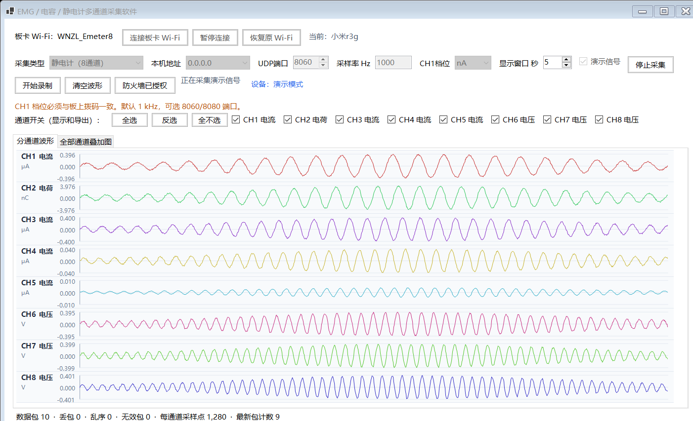

# EMG、电容与静电计多通道采集软件

这是一个 Windows x64 多通道信号采集软件，支持以下三类微纳智联 Wi-Fi 采集板：

- 8 通道 EMG 采集板；
- 35 个测量通道加 5 个参考通道的电容采集板；
- 8 通道静电计。

软件在同一主界面中完成板卡 Wi-Fi 连接、UDP 数据接收、协议解析、实时波形显示、通道选择、运行状态监测和 CSV 数据导出。

> 重要：软件启动时不会自动连接或切换 Wi-Fi。只有用户点击“连接板卡 Wi-Fi”或开始真实采集后，软件才会尝试连接板卡。

## 下载普通版

不需要安装开发工具的使用者，请从 [GitHub Releases](https://github.com/xf959211192/emg-capacitance-electrometer-collector/releases/latest) 下载：

`EMG-Capacitance-Electrometer-Collector-v17-win-x64.zip`

v17 直接下载地址：
[EMG-Capacitance-Electrometer-Collector-v17-win-x64.zip](https://github.com/xf959211192/emg-capacitance-electrometer-collector/releases/download/v17/EMG-Capacitance-Electrometer-Collector-v17-win-x64.zip)

普通版已经包含 .NET 运行环境。下载后必须先完整解压，再双击：

`EMG电容静电计采集软件.exe`

不要在 ZIP 内直接运行，也不要只复制或单独发送 EXE。普通版由 EXE、多个 DLL 和 Word 技术说明共同组成，缺少 DLL 时软件可能无法打开。

## 压缩包内容

- `EMG电容静电计采集软件.exe`：主程序；
- `D3DCompiler_47_cor3.dll` 等 DLL：Windows 图形界面运行所需文件；
- `使用说明.md`：快速说明；
- `EMG电容静电计多通道采集软件_小论文_v17.docx`：小论文版式技术说明，包含参数、协议、操作流程、测试结果和故障排查。

技术说明也可在仓库中直接下载：
[EMG电容静电计多通道采集软件_技术说明_v17.docx](docs/EMG电容静电计多通道采集软件_技术说明_v17.docx)。

## 软件界面



软件提供两种波形页面：

- 分通道波形：每个通道单独显示，纵轴包含数值和物理单位；可见通道较少时图形高度自动增加；
- 全部通道叠加图：在同一图中比较各通道变化时刻。静电计包含 μA、nC 和 V 三种量纲，因此叠加图标记为“混合单位”。

通道区域支持单独开关、全选、反选和全不选。通道选择同时决定波形显示和下一次 CSV 导出的数据列。录制期间通道开关会锁定，避免同一个文件的列结构中途改变。

## 支持的板卡参数

| 模式 | 通道 | Wi-Fi 名称 | 默认密码 | 默认采样率 | UDP 端口 | 显示与导出单位 |
| --- | --- | --- | --- | --- | --- | --- |
| EMG | CH1—CH8 | `WNZL_Emg` | `Eemg1234` | 1000 Hz | 8060 | V |
| 电容 | PC1—PC35、REF1—REF5 | `ESP32_Pcap35` | `pcap1234` | 每通道 100 Hz | 8080 | pF |
| 静电计 | CH1—CH8 | `WNZL_Emeter8` | `emeter1234` | 默认 1000 Hz | 8060 或 8080 | μA、nC、V |

板卡协议要求电脑无线网卡获得本机地址 `192.168.4.2`。板卡通常使用 `192.168.4.1` 向电脑发送 UDP 数据。

### EMG 数据

- 每包包含 8 通道，每通道 128 个采样点；
- 原始样本为 16 位有符号小端整数；
- 原始值除以 3276.8 后得到电压，单位为 V；
- 数据先排列 CH1—CH4 的 128 组，再排列 CH5—CH8 的 128 组；
- 软件校验帧头、帧尾、包长、通道数和采样点数。

### 电容数据

- 35 个 PC 测量通道加 5 个 REF 参考通道，共 40 通道；
- 每包包含每通道 10 次采样；
- 原始值为 32 位小端无符号整数；
- 原始值除以 1000 后以 pF 显示和导出；
- 标称测量范围为 0 到约 1.5 nF。

### 静电计数据

静电计使用与 EMG 相同的 8 通道、每通道 128 点数据帧，再按通道进行倍率和单位换算：

| 通道 | 测量量 | 换算倍率 | 软件单位 |
| --- | --- | --- | --- |
| CH1 | 电流 | nA 档×1、μA 档×1000、mA 档×1000000 | μA |
| CH2 | 电荷 | ×10 | nC |
| CH3 | 电流 | ×1 | μA |
| CH4 | 电流 | ×0.1 | μA |
| CH5 | 电流 | ×0.01 | μA |
| CH6—CH8 | 电压 | ×1 | V |

静电计 CH1 的软件档位必须与板上拨码一致。切换档位前应先停止录制和采集。

## 首次使用流程

1. 下载普通版 ZIP，并完整解压到一个普通文件夹。
2. 双击 `EMG电容静电计采集软件.exe`。
3. 给板卡上电，在软件中选择 EMG、电容或静电计模式。
4. 点击“连接板卡 Wi-Fi”。
5. 等待当前热点名称和本机地址更新。Windows 连接热点并获得 `192.168.4.2` 最长可能需要约 30 秒。
6. 如果不想继续等待，点击“暂停连接”。暂停会停止软件继续等待和尝试其他板卡。
7. 首次真实采集前点击“配置防火墙”，并在 Windows 管理员确认窗口中点击“是”。
8. 核对本机地址、UDP 端口、采样率和静电计 CH1 档位。
9. 点击“开始采集”，确认设备状态显示“正常”，并且数据包计数持续增加。
10. 选择需要保存的通道，点击“开始录制”并选择 CSV 保存位置。
11. 实验完成后，依次点击“停止录制”和“停止采集”。
12. 需要恢复互联网时，点击“恢复原 Wi-Fi”。

没有板卡时可以勾选“演示信号”检查界面、通道开关和波形显示。演示信号不经过 Wi-Fi 和 UDP，不能证明真实板卡通信正常。

## Wi-Fi 连接逻辑

- 软件启动时只读取当前网络状态，不会主动连接板卡；
- 用户点击连接后，软件先尝试当前指定模式对应的板卡；
- 当前板卡连接失败后，软件再尝试另外两类板卡；
- 如果连接到了其他板卡，主页会自动切换到对应模式；
- 软件不要求板卡热点必须先出现在 Windows 扫描列表中，可以直接使用已知 SSID 和密码连接；
- 连接过程可以暂停；
- 板卡热点通常不提供互联网，连接后电脑暂时无法上网属于正常现象；
- 采集完成后可以使用“恢复原 Wi-Fi”返回连接板卡前的网络。

软件创建的板卡 Wi-Fi 配置采用手动连接方式。如果 Windows 中原有同名 Wi-Fi 配置已经勾选“自动连接”，Windows 仍可能自行连接该热点，需要在 Windows Wi-Fi 设置中取消自动连接。

## 为什么需要配置防火墙

板卡通过 UDP 主动向电脑发送数据。Windows 可能允许电脑连接板卡热点，但仍阻止 UDP 数据进入软件，因此会出现“Wi-Fi 已连接但没有数据”。

软件的“配置防火墙”功能会请求一次管理员权限，并创建以下入站规则：

- 开放 UDP 8060；
- 开放 UDP 8080；
- 同时覆盖专用网络和公用网络；
- 远程来源限制为板卡地址 `192.168.4.1`。

每台电脑都需要单独完成一次授权。把软件发给朋友后，朋友电脑上的防火墙规则不会自动从原电脑复制过去。

## CSV 导出格式

CSV 只保存实验需要的字段：

1. 接收时间；
2. 相对时间_s；
3. 用户在开始录制前选定的通道数据。

软件不会把包计数、设备状态或其他协议字段写入 CSV。

各模式的通道列示例：

- EMG：`CH1电压_V` 至 `CH8电压_V`；
- 电容：`REF1电容_pF`、`PC1电容_pF` 等；
- 静电计：`CH1电流_μA`、`CH2电荷_nC`、`CH6电压_V` 等。

接收时间根据数据包到达时间和采样率回推，相对时间从本次录制的第一个样本开始。采样率设置错误会导致相对时间间隔错误，因此必须在录制前核对采样率。

## 常见问题

### 手机能看到板卡热点，但电脑连接不上

1. 确认板卡已经正常供电；
2. 在软件中选择对应模式，再点击“连接板卡 Wi-Fi”；
3. 等待最多约 30 秒，不要刚显示连接中就判定失败；
4. 如果 Windows 保存了同名但密码错误的旧配置，可先在 Windows Wi-Fi 设置中“忘记”该网络，再由软件重新建立配置。

### Wi-Fi 已连接，但软件没有数据

按以下顺序检查：

1. 当前 Wi-Fi 名称是否与软件模式一致；
2. 本机地址是否为 `192.168.4.2`；
3. EMG 是否使用 8060，电容是否使用 8080，静电计是否尝试过 8060 和 8080；
4. 是否点击过“配置防火墙”并完成管理员授权；
5. 是否同时打开了两个采集软件，或有其他程序占用相同 UDP 端口；
6. 数据包数、无效包数和设备状态是否发生变化。

### 发给其他电脑后收不到数据

- 必须发送完整 ZIP，不能只发送 EXE；
- 接收方必须先完整解压；
- 接收方电脑需要重新执行一次“配置防火墙”；
- 接收方电脑的无线网卡也必须获得 `192.168.4.2`；
- 如果 Windows 防火墙最初选错了网络类型，重新使用软件的“配置防火墙”功能统一创建规则。

### 连接板卡后电脑没有互联网

这是正常现象。板卡热点只用于局域网数据传输，通常不提供互联网。采集结束后点击“恢复原 Wi-Fi”，或从 Windows 网络菜单手动连接原网络。

### CSV 缺少通道或时间间隔不正确

- 缺少通道：停止录制，在通道区域勾选所需通道后重新创建 CSV；
- 时间间隔错误：停止录制和采集，将采样率改为板卡实际采样率后重新录制。

### Windows 显示 SmartScreen 提示

当前普通版没有商业数字签名，Windows 可能显示 SmartScreen 提示。请只从本仓库 Releases 下载，并核对下面的 SHA-256。

## 文件校验

v17 含小论文版式技术说明压缩包 SHA-256：

```text
8E120D9979A5B281B8F53927F3C5630B4AB22D2392CBC9E978A3002152ABD11C
```

Windows PowerShell 校验命令：

```powershell
Get-FileHash -Algorithm SHA256 ".\EMG-Capacitance-Electrometer-Collector-v17-win-x64.zip"
```

输出结果应与上面的 SHA-256 完全一致。

## 已完成的验证

- .NET 8 Release 构建：0 个警告、0 个错误；
- 协议解析、UDP 回环与 CSV：15 项自动化测试全部通过；
- EMG、电容和静电计界面冒烟测试：通过；
- 启动网络测试：未点击连接或开始真实采集时，当前 Wi-Fi 保持不变；
- Word 技术说明：7 页逐页渲染检查通过，可访问性检查无问题。

## 从源代码构建

源代码构建需要 .NET 8 SDK 和 Windows x64 环境。

```powershell
dotnet restore "EmgCollector.sln"
dotnet build "EmgCollector.sln" -c Release
dotnet run --project "tests/EmgCollector.ProtocolTests/EmgCollector.ProtocolTests.csproj" -c Release
dotnet run --project "tests/EmgCollector.UiSmoke/EmgCollector.UiSmoke.csproj" -c Release
```

生成包含 .NET 运行环境的普通版：

```powershell
dotnet publish "src/EmgCollector/EmgCollector.csproj" `
  -c Release -r win-x64 --self-contained true `
  -p:PublishSingleFile=true
```

真实 Wi-Fi 测试会切换电脑当前网络，不属于默认测试流程。执行前请先阅读 `tests/EmgCollector.WifiSmoke` 中的测试入口。

## 项目结构

- `src/EmgCollector`：Windows 主程序；
- `tests/EmgCollector.ProtocolTests`：协议解析、UDP 回环和 CSV 测试；
- `tests/EmgCollector.UiSmoke`：三种模式的界面冒烟测试；
- `tests/EmgCollector.WifiSmoke`：真实板卡 Wi-Fi 测试入口；
- `tools/EmgFirewallConfigurator`：管理员防火墙配置工具；
- `docs`：软件截图和技术说明。

厂家原始 PDF、Word 和 Excel 协议资料不在仓库中重新发布，已确认的协议参数已经整理到代码和技术说明中。

## 开源许可

代码使用 [MIT License](LICENSE)。第三方库和厂家硬件资料仍遵循各自许可。

## 问题反馈

提交问题时请同时提供：

- 使用的板卡模式和当前 Wi-Fi 名称；
- 本机 IPv4 地址；
- UDP 端口和采样率；
- 软件显示的设备状态、数据包数、丢包数和无效包数；
- 是否已经点击“配置防火墙”；
- 软件截图，以及可安全公开的少量数据样本。
